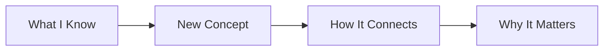
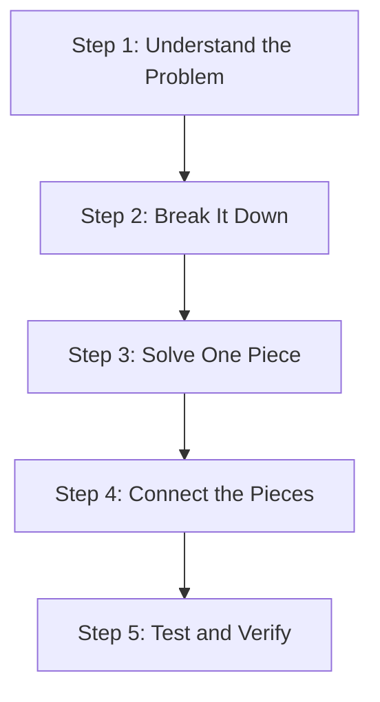
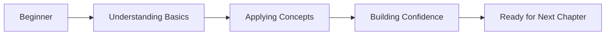

# BOOK AUTHORING GUIDELINES FOR BEGINNER-FRIENDLY CONTENT

This document contains instructions for writing technical books and chapters that prioritize clear, beginner-friendly explanations. Our goal is to make complex concepts accessible while building confidence in new learners.

## BEGINNER-FIRST PHILOSOPHY

**CORE PRINCIPLE**: Every chapter should feel like a patient mentor explaining concepts step-by-step. We prioritize understanding over brevity, clarity over complexity.

### Beginner-Friendly Approach:
- **Slower pace**: Take time to fully explain each concept before moving forward
- **Connect the dots**: Explicitly link new concepts to previously learned material
- **Build confidence**: Use encouraging language and celebrate small wins
- **Multiple explanations**: Explain concepts in different ways to reach different learning styles
- **No assumptions**: Never assume readers know related concepts

### Chapter Philosophy:
- **One main idea**: Each chapter focuses on mastering one core concept thoroughly
- **Progressive building**: Each concept builds naturally from the previous one
- **Practical relevance**: Always explain why a concept matters in real-world development
- **Learning support**: Provide multiple ways to understand difficult concepts

## BEGINNER-FRIENDLY CHAPTER STRUCTURE

### CHAPTER STRUCTURE REQUIREMENTS (LEARNING-FOCUSED)
Every chapter MUST include these sections designed for maximum learning effectiveness:

- **Title (H1)**: Gentle introduction that connects to what beginners already know
- **Introduction (H2)**: Warm welcome explaining what we'll discover together and why it's exciting
- **Learning Objectives (H2)**: Clear, achievable goals that build confidence
- **Concept Foundation (H2)**: Essential background knowledge explained simply
- **Core Learning Sections (H2)**: 3-4 main concepts explained step-by-step with plenty of examples
- **Putting It Together (H2)**: Show how all concepts connect in a complete example
- **Practice Time (H2)**: Guided exercises that reinforce learning
- **Solution Walkthrough (H2)**: Detailed explanation of solutions with learning insights
- **Knowledge Check (H2)**: 1-2 friendly questions to confirm understanding
- **Chapter Recap (H2)**: Summary that celebrates what was learned and previews next steps

### BEGINNER-FRIENDLY WRITING REQUIREMENTS
- **Patient explanations**: Take time to fully explain each concept
- **Multiple angles**: Explain difficult concepts in 2-3 different ways
- **Explicit connections**: Always explain how new concepts relate to previous learning
- **Encouraging tone**: Use supportive language that builds confidence
- **Real-world relevance**: Constantly explain why concepts matter in practice
- **Learning scaffolding**: Provide support structures for understanding

## PEDAGOGY-FOCUSED CONTENT GUIDELINES

### Code Examples for Beginners:
- **Start tiny**: Begin with 3-5 line examples that demonstrate one concept
- **Incremental growth**: Add one new concept at a time to existing code
- **Extensive commenting**: Every line should have a purpose that's explained
- **Multiple examples**: Show the same concept in different contexts
- **Complete context**: Always show where code fits in a larger project
- **Error prevention**: Explain common mistakes before they happen

### Concept Introduction Pattern:
1. **Connect to known**: Start with something the reader already understands
2. **Introduce gently**: Present the new concept with simple language
3. **Show simple example**: Demonstrate with the easiest possible case
4. **Explain thoroughly**: Break down every part of the example
5. **Add complexity slowly**: Introduce variations one at a time
6. **Practice together**: Work through examples step-by-step
7. **Reinforce learning**: Summarize what was just learned

### Visual Learning Support:
- **Simple diagrams**: Use visual metaphors beginners can relate to
- **Step-by-step flowcharts**: Show process flows with clear decision points
- **Before/after comparisons**: Show the transformation that concepts create
- **Mental model building**: Help readers visualize abstract concepts
- **Progress indicators**: Show learners how far they've come

### Language and Tone Guidelines:
- **Conversational approach**: Write like you're sitting next to a friend
- **Positive reinforcement**: Celebrate understanding and progress regularly
- **Patience with complexity**: Never rush through difficult concepts
- **Avoiding jargon**: Explain technical terms immediately when introduced
- **Encouraging mistakes**: Frame errors as learning opportunities
- **Building confidence**: Acknowledge that learning programming is challenging but rewarding

## BOOK PROJECT STRUCTURE REQUIREMENTS

### Standard Book Directory Structure
```
book-project/
├── README.md                 # Main book overview
├── TOC.md                   # Table of contents
├── WRITING-GUIDELINES.md    # General writing guidelines
├── BOOK.md                  # This file - book-specific guidelines
└── chapters/
    ├── 01-chapter-name/
    │   ├── README.md        # Chapter content
    │   ├── assets/
    │   │   ├── data/
    │   │   ├── diagrams/
    │   │   └── images/
    │   └── solution/
    │       ├── [language-specific files]
    │       ├── src/
    │       ├── tests/
    │       └── README.md
    └── 02-next-chapter/
        └── [same structure]
```

### Chapter File Organization
Each chapter must follow this structure:
- **README.md**: Primary chapter content following structure requirements
- **assets/**: Supporting materials (images, diagrams, data files)
- **solution/**: Complete working code that matches chapter examples exactly, with comprehensive README.md explaining all implementations

### Language-Specific File Structure
Ensure solution directory matches target language:
- **Go projects**: `main.go`, `go.mod`, appropriate package structure
- **TypeScript projects**: `package.json`, `.ts` files, proper module structure
- **Rust projects**: `Cargo.toml`, `src/main.rs`, proper crate structure
- **Python projects**: `requirements.txt`, proper package structure

## BEGINNER-FRIENDLY VISUAL CONTENT

### Learning-Focused Diagrams
Every chapter should include 3-4 visual elements that support understanding:

**Concept Introduction Diagrams**: Use simple visuals to introduce abstract ideas


**Step-by-Step Process Diagrams**: Break complex processes into digestible steps


**Learning Progress Visualizations**: Show learners their journey and progress


### Tables for Learning Support
Use tables to organize information that helps learning rather than just reference:

| Learning Stage | What You'll Do | How It Feels | Support Available |
|---------------|----------------|---------------|-------------------|
| First Exposure | Read and wonder | Confused but curious | Detailed explanations |
| Understanding | Practice examples | "Aha!" moments | Step-by-step guides |
| Application | Build your own | Confident but careful | Solution walkthroughs |
| Mastery | Teach others | Excited and capable | Advanced challenges |

### Visual Content Placement for Learning:
- **Before complex concepts**: Use diagrams to prepare the mind
- **During explanations**: Show visuals alongside text for multiple learning styles
- **After practice**: Use visuals to reinforce what was just learned
- **For emotional support**: Include progress indicators and encouragement

## LEARNING-CENTERED CONTENT STANDARDS

### Technical Content for Beginners
- **Simple foundations first**: Start with basic concepts before introducing advanced features
- **Security mindset from day one**: Explain why security matters in terms beginners understand
- **Learning progression**: Each technical concept builds naturally on previous understanding
- **Practical application**: Show how every concept solves real problems beginners face
- **Error-friendly environment**: Create safe spaces to make and learn from mistakes

### Educational Content Requirements
- **Scaffolded learning**: Provide support structures that can be gradually removed
- **Multiple pathways**: Offer different approaches for different learning styles
- **Frequent check-ins**: Regular opportunities to assess and reinforce understanding
- **Confidence building**: Design experiences that build programming self-efficacy
- **Real-world connections**: Constantly link learning to practical applications

## TABLE OF CONTENTS CREATION GUIDELINES

When creating TOC.md, structure each chapter with:

### Essential Elements per Chapter:
- **Problem statement**: Brief description of the problem and why it's important (2-3 sentences)
- **Learning objectives**: Bullet list of specific skills/knowledge readers will gain (4-6 items)
- **Key concepts**: 3 major concepts that will be covered
- **Exercises**: 2 practical exercises for hands-on learning
- **Quiz question**: 1 question testing understanding with 3 options
- **Major assignment**: 1 comprehensive project applying all concepts

### TOC Quality Standards:
- Progressive difficulty from basic to advanced concepts
- Clear dependencies between chapters
- Practical, real-world focus throughout
- Comprehensive skill development pathway
- Industry-relevant examples and scenarios

## BEGINNER-FRIENDLY QUALITY CHECKLIST

### Learning-Focused Chapter Elements:
- ✅ Title that welcomes beginners and connects to their existing knowledge
- ✅ Introduction that builds excitement about learning and explains relevance
- ✅ Learning objectives that feel achievable and confidence-building
- ✅ Concept foundation section that establishes necessary background
- ✅ 3-4 core learning sections with patient, step-by-step explanations
- ✅ "Putting it together" section showing how concepts connect
- ✅ Guided practice with supportive instructions
- ✅ Solution walkthrough that explains not just what but why
- ✅ 1-2 friendly knowledge check questions
- ✅ Encouraging recap that celebrates progress and previews next steps

### Pedagogical Quality:
- ✅ Every concept is introduced with connection to prior knowledge
- ✅ Complex ideas are explained in multiple ways
- ✅ Code examples start simple (3-5 lines) and grow incrementally
- ✅ Every code line has clear purpose and explanation
- ✅ Technical terms are defined immediately when introduced
- ✅ Encouraging tone that builds confidence throughout
- ✅ Frequent "why this matters" explanations
- ✅ Visual diagrams that support understanding, not just decoration

### Learning Support:
- ✅ Concepts build logically from simple to complex
- ✅ Multiple examples showing same concept in different contexts
- ✅ Clear connections between each section explained explicitly
- ✅ Patient pace that doesn't rush through difficult concepts
- ✅ Supportive language that acknowledges learning challenges

## LEARNING-FOCUSED FAILURE CONDITIONS

Chapter authoring fails if:
- Concepts are introduced without connecting to prior knowledge
- Technical terms are used without immediate, clear definitions
- Code examples jump to complex implementations without building up gradually
- Explanations assume knowledge that beginners don't have
- The tone feels intimidating or assumes existing expertise
- Sections don't explicitly connect to each other
- Learning objectives feel overwhelming rather than achievable
- Practice exercises don't provide enough scaffolding
- The pace moves too quickly through complex concepts
- Visual elements don't support learning objectives

## SUCCESS METRICS FOR BEGINNER-FRIENDLY CONTENT

A successful chapter achieves:
- **Conceptual clarity**: Complex ideas broken down into understandable pieces
- **Learning confidence**: Readers feel capable and excited to continue
- **Practical understanding**: Concepts connect clearly to real-world applications
- **Scaffolded progression**: Each step builds naturally on the previous
- **Multiple learning pathways**: Visual, textual, and practical approaches provided
- **Encouraging tone**: Supportive language that builds programming confidence
- **Connection building**: Explicit links between concepts and prior knowledge

Remember: Create educational content that makes beginners feel welcome, supported, and capable of mastering complex programming concepts through patient, clear instruction and plenty of practice opportunities.